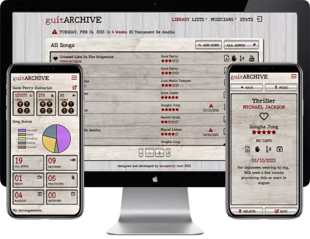

# guitARCHIVE

A simple app in which guitarists can store and access their sheet music from any device. Optional Youtube API for channel stats, which with the option to set individual song statuses, help you manage your guitar playing workflow.

## Authors

- [@davedevperry](https://github.com/DaveDevPerry)

## Screenshots

## Features

- CRUD functionality
- Song library
- Song Ideas list
- Songs to find music for list
- Full screen mode
- Cross platform
- Mobile responsive

## Tech Stack

**Client:** React, Styled-components CSS

**Server:** Node, Express, Mongo

## How to use?

1. Create a root folder. eg /guitarchive
2. cd guitarchive
3. mkdir frontend && mkdir backend

#### Clone the frontend

4. open /guitarchive/frontend in your IDE (vscode etc)
5. git clone https://github.com/DaveDevPerry/guitarchive_client.git .
6. npm install
7. add .env file (see Environment Variables below for example)

#### Clone the backend

8. open /guitarchive/backend in your IDE (vscode etc)
9. git clone https://github.com/DaveDevPerry/guitarchive_server.git .
10. npm install
11. add .env file (see backend readme)

### Run locally

12. in /guitarchive/backend - npm run dev
13. in /guitarchive/frontend - npm start
14. view in browser http://localhost:3000

## Related

Here is the link to the backend code for this project

[guitARCHIVE Backend](https://github.com/DaveDevPerry/guitarchive_server)

## Environment Variables

To run this project, you will need to add the following environment variables to your .env file

`REACT_APP_PUBLIC_MY_KEY`=youtube channel api key

`REACT_APP_PUBLIC_MY_USER_ID`=youtube user/channel id

`REACT_APP_BACKEND_URL`=https://example-backend-server.onrender.com

`REACT_APP_NODE_ENV`=production

## Color Reference

| Color           | Hex                                                              |
| --------------- | ---------------------------------------------------------------- |
| Primary Color   |  #1d0b01 |
| Secondary Color |  #7f0101 |

## Future Features

- Scales Section
- Tutorial Section
- Request and Share Sheet Music with other users
- Payments with PayPal for owners composition / arrangement
- Friends List
- Like Music Feature
- Song statistics

## Support

For support, email dave@daveperry.tech.

## Feedback

If you have any feedback, please reach out to me at dave@daveperry.tech

<!--

## Motivation

<!-- A short description of the motivation behind the creation and maintenance of the project. This should explain **why** the project exists. -->

<!-- I first designed the loopy lotto in excel and played it at work with colleagues. Then I started to learn web development so it made sense that I coded it up. It was my first project using Javascript and during the development process I also learnt SASS.
I now play among family and friends. -->

<!-- ## Build status

Build status of continue integration i.e. travis, appveyor etc. Ex. -

 -->

## Contact

If you want to contact me you can reach me at [daveperry.tech](https://daveperry.tech)

<!-- [loopy lotto repo](https://github.com/your_username/repo_name) -->

## License

<!-- A short snippet describing the license (MIT, Apache etc) -->

Distributed under the MIT License. See [LICENSE.txt](LICENSE.txt) for more information.

<!-- MIT © [Dave Perry]() -->
<!--
# Getting Started with Create React App

This project was bootstrapped with [Create React App](https://github.com/facebook/create-react-app).

## Available Scripts

In the project directory, you can run:

### `npm start`

Runs the app in the development mode.\
Open [http://localhost:3000](http://localhost:3000) to view it in your browser.

The page will reload when you make changes.\
You may also see any lint errors in the console.

### `npm test`

Launches the test runner in the interactive watch mode.\
See the section about [running tests](https://facebook.github.io/create-react-app/docs/running-tests) for more information.

### `npm run build`

Builds the app for production to the `build` folder.\
It correctly bundles React in production mode and optimizes the build for the best performance.

The build is minified and the filenames include the hashes.\
Your app is ready to be deployed!

See the section about [deployment](https://facebook.github.io/create-react-app/docs/deployment) for more information.

### `npm run eject`

**Note: this is a one-way operation. Once you `eject`, you can't go back!**

If you aren't satisfied with the build tool and configuration choices, you can `eject` at any time. This command will remove the single build dependency from your project.

Instead, it will copy all the configuration files and the transitive dependencies (webpack, Babel, ESLint, etc) right into your project so you have full control over them. All of the commands except `eject` will still work, but they will point to the copied scripts so you can tweak them. At this point you're on your own.

You don't have to ever use `eject`. The curated feature set is suitable for small and middle deployments, and you shouldn't feel obligated to use this feature. However we understand that this tool wouldn't be useful if you couldn't customize it when you are ready for it.

## Learn More

You can learn more in the [Create React App documentation](https://facebook.github.io/create-react-app/docs/getting-started).

To learn React, check out the [React documentation](https://reactjs.org/).

### Code Splitting

This section has moved here: [https://facebook.github.io/create-react-app/docs/code-splitting](https://facebook.github.io/create-react-app/docs/code-splitting)

### Analyzing the Bundle Size

This section has moved here: [https://facebook.github.io/create-react-app/docs/analyzing-the-bundle-size](https://facebook.github.io/create-react-app/docs/analyzing-the-bundle-size)

### Making a Progressive Web App

This section has moved here: [https://facebook.github.io/create-react-app/docs/making-a-progressive-web-app](https://facebook.github.io/create-react-app/docs/making-a-progressive-web-app)

### Advanced Configuration

This section has moved here: [https://facebook.github.io/create-react-app/docs/advanced-configuration](https://facebook.github.io/create-react-app/docs/advanced-configuration)

### Deployment

This section has moved here: [https://facebook.github.io/create-react-app/docs/deployment](https://facebook.github.io/create-react-app/docs/deployment)

### `npm run build` fails to minify

This section has moved here: [https://facebook.github.io/create-react-app/docs/troubleshooting#npm-run-build-fails-to-minify](https://facebook.github.io/create-react-app/docs/troubleshooting#npm-run-build-fails-to-minify) -->
